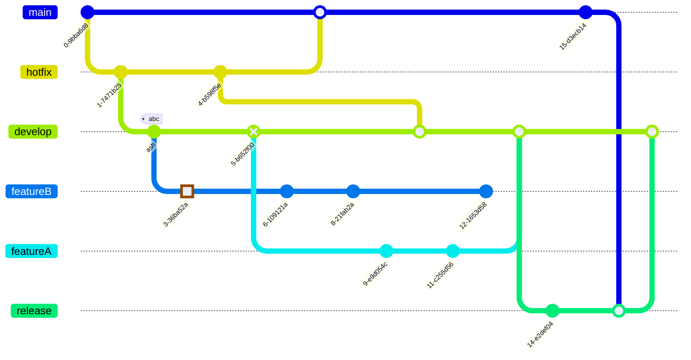

# Header 1

Lorem ipsum dolor sit amet :octocat: :squirrel:, consectetur adipiscing elit, sed do eiusmod tempor incididunt ut labore et dolore magna aliqua. Ut enim ad minim veniam, quis nostrud exercitation ullamco laboris nisi ut aliquip ex ea commodo consequat. Duis aute irure dolor in reprehenderit in voluptate velit esse cillum dolore eu fugiat nulla pariatur. Excepteur sint occaecat cupidatat non proident, sunt in culpa qui officia deserunt mollit anim id est laborum.

## Header 2

Lorem [ipsum dolor](read-me) sit amet, consectetur *adipiscing* **elit**, sed do eiusmod tempor incididunt ut labore et dolore magna aliqua. Ut enim ad minim veniam, quis nostrud exercitation ullamco laboris nisi ut aliquip ex ea commodo consequat:

- List Item One
  * List Item One
  * [List Item Two](/jekyll-shell-theme)
  * List Item Three
- List Item Two
- List Item Three

### Header 3

Duis aute irure dolor in reprehenderit in voluptate velit esse cillum dolore eu fugiat nulla pariatur. Excepteur sint occaecat cupidatat non proident, sunt in culpa qui officia deserunt mollit anim id est laborum.

1. Ordered List Item 1
  * item
2. Ordered List Item 1
3. Ordered List Item 1


```c
float Q_rsqrt( float number )
{
	long i;
	float x2, y;
	const float threehalfs = 1.5F;

	x2 = number * 0.5F;
	y  = number;
	i  = * ( long * ) &y;                       // evil floating point bit level hacking
	i  = 0x5f3759df - ( i >> 1 );               // what the fuck?
	y  = * ( float * ) &i;
	y  = y * ( threehalfs - ( x2 * y * y ) );   // 1st iteration
//	y  = y * ( threehalfs - ( x2 * y * y ) );   // 2nd iteration, this can be removed

	return y;
}

```


```java
public class Armstrong {
    
    public static void main(String[] args) {

        int low = 999, high = 99999;

        for(int number = low + 1; number < high; ++number) {

            if (checkArmstrong(number))
                System.out.print(number + " ");
        }
    }

    public static boolean checkArmstrong(int num) {
        int digits = 0;
        int result = 0;
        int originalNumber = num;

        // number of digits calculation
        while (originalNumber != 0) {
            originalNumber /= 10;
            ++digits;
        }

        originalNumber = num;

        // result contains sum of nth power of its digits
        while (originalNumber != 0) {
            int remainder = originalNumber % 10;
            result += Math.pow(remainder, digits);
            originalNumber /= 10;
        }

        if (result == num)
            return true;

        return false;
    }
}
```


|  1  |  1  |
| :---: | :---: |
|  2   |   2   |

`1`



$$f(x) = 1$$

 $$
\begin{aligned}
\nabla \cdot \mathbf{E} &= \frac{\rho}{\varepsilon_0} \\
\nabla \cdot \mathbf{B} &= 0 \\
\nabla \times \mathbf{E} &= -\frac{\partial \mathbf{B}}{\partial t} \\
\nabla \times \mathbf{B} &= \mu_0\left(\mathbf{J} + \varepsilon_0 \frac{\partial \mathbf{E}}{\partial t}\right)
\end{aligned}
$$

$$ \zeta(s) = \sum_{n=1}^{\infty} \frac{1}{n^s} $$
